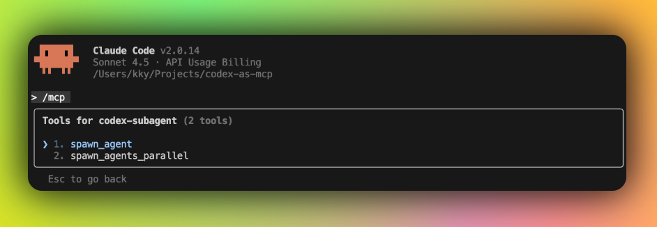
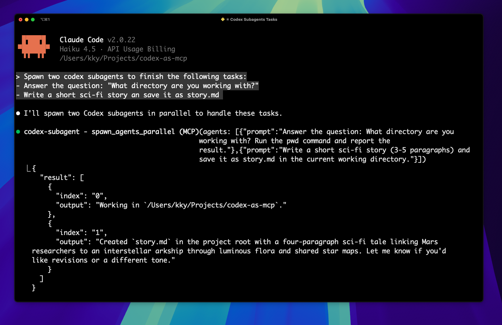
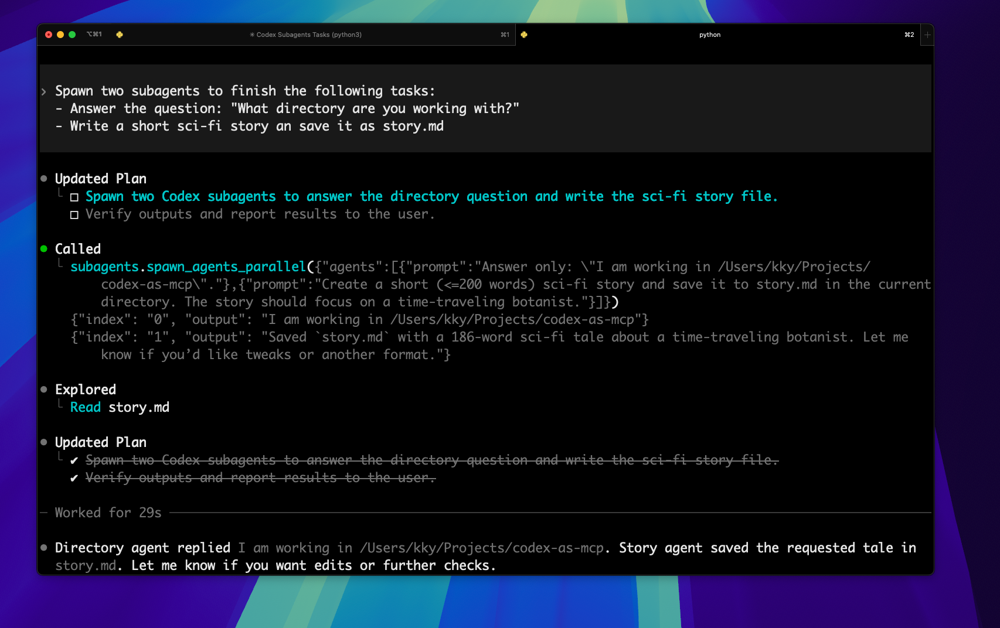

# codex-as-mcp

[中文版](./README.zh-CN.md)

**Spawn multiple subagents via Codex-as-MCP**

Each subagent runs `codex e --full-auto` with complete autonomy inside the MCP server's current working directory. Perfect for Plus/Pro/Team subscribers leveraging GPT-5 capabilities.

**Use it in Claude Code**

There are two tools in codex-as-mcp


You can spawn parallel codex subagents using prompt.


Here's a sample Codex session delegating two tasks in parallel.


## Setup

### 1. Install Codex CLI

**Requires Codex CLI >= 0.46.0**

```bash
npm install -g @openai/codex@latest
codex login

# Verify installation
codex --version
```

### 2. Configure MCP

Add to your `.mcp.json`:
```json
{
  "mcpServers": {
    "codex-subagent": {
      "type": "stdio",
      "command": "uvx",
      "args": ["codex-as-mcp@latest"]
    }
  }
}
```

Or use Claude Desktop commands:
```bash
claude mcp add codex-subagent -- uvx codex-as-mcp@latest
```

If you're configuring Codex CLI directly (for example `~/.config/codex/config.toml`), add:
```toml
[mcp_servers.subagents]
command = "uvx"
args = ["codex-as-mcp@latest"]
```

## Tools

- `spawn_agent(prompt: str)` – Spawns an autonomous Codex subagent using the server's working directory and returns the agent's final message.
- `spawn_agents_parallel(agents: list[dict])` – Spawns multiple Codex subagents in parallel; each item must include a `prompt` key and results include `output` and `error` per agent (empty string if none).

## Environment variables (optional)

- `CODEX_AS_MCP_AGENT_TIMEOUT_SECONDS`: Overall timeout for each spawned Codex run (default: 8 hours).
- `CODEX_AS_MCP_LOAD_DOTENV=1`: Load `./.env` from the server working directory and inject it into the `codex` subprocess env (useful with sanitized stdio envs).
  - `CODEX_AS_MCP_DOTENV_PATH` (default: `.env`)
  - `CODEX_AS_MCP_DOTENV_OVERRIDE=1` to override existing env vars instead of only filling missing ones.
- `CODEX_AS_MCP_REQUIRED_ENV_VARS`: Comma-separated list of env vars to require before launching Codex (fails fast with a clear error). Example: `OPENAI_API_KEY,FOO_TOKEN`.
- `CODEX_AS_MCP_SOURCE_SHELL_ENV`: Source common shell rc files and merge the resulting environment into the `codex` subprocess env. Default: enabled. Set `0` to disable.
  - `CODEX_AS_MCP_SHELL_RC_FILES`: Comma-separated list of rc files to source (default: `.zshrc,.zprofile,.bashrc,.bash_profile,.profile` in `$HOME`).
  - `CODEX_AS_MCP_SHELL`: Shell to use for sourcing (default: `$SHELL`, then `zsh`, `bash`, `sh`).
  - `CODEX_AS_MCP_SHELL_ENV_TIMEOUT_SECONDS`: Timeout for sourcing rc files (default: 5).
  - `CODEX_AS_MCP_SHELL_ENV_OVERRIDE=1`: Override all env vars with the sourced shell env (default: only fills missing vars, but always refreshes `PATH`).
